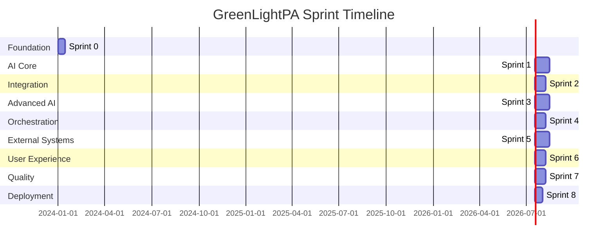

# Sprint Roadmap: GreenLightPA Hybrid Architecture

## 🎯 Project Overview

**Total Duration**: 28 weeks (7 months)  
**Architecture**: Hybrid N8n + LangChain approach  
**Goal**: Automate prior authorization process with visual workflow orchestration and advanced AI capabilities

## 📅 Sprint Timeline & Dependencies

## 🚀 Sprint-by-Sprint Breakdown

### **Sprint 0: Foundations** (Weeks 1-2)
**🎯 Goal**: Establish solid infrastructure foundation  
**👥 Team Focus**: DevOps + Backend Engineers  

#### Key Deliverables
- [ ] Repository setup with CI/CD pipeline
- [ ] Docker Compose development environment
- [ ] PostgreSQL + pgvector + Redis + N8n + ChromaDB
- [ ] Security framework (JWT, HIPAA compliance)
- [ ] Health check endpoints and monitoring setup

#### Success Criteria
- ✅ Any developer can run full stack in <30 minutes
- ✅ CI/CD pipeline builds and tests successfully
- ✅ All core services are running and accessible

#### Dependencies for Next Sprint
- Infrastructure services operational
- Database schemas created
- N8n basic setup completed

---

### **Sprint 1: Core AI Pipeline** (Weeks 3-6)
**🎯 Goal**: Build LangChain NLP and RAG capabilities  
**👥 Team Focus**: AI Engineer + Backend Engineer  

#### Key Deliverables
- [ ] FHIR document processing with LangChain
- [ ] Clinical code extraction (ICD-10, CPT, HCPCS, NDC, SNOMED)
- [ ] ChromaDB vector store with medical embeddings
- [ ] Basic RAG engine for policy document queries
- [ ] LangSmith observability integration

#### Success Criteria
- ✅ Code extraction achieves ≥90% recall
- ✅ Vector similarity search returns relevant policies
- ✅ End-to-end latency <5 seconds
- ✅ All AI operations are traced in LangSmith

#### Dependencies for Next Sprint
- LangChain services exposing REST APIs
- ChromaDB collections initialized
- Clinical code extraction working

---

### **Sprint 2: N8n Integration** (Weeks 7-9)
**🎯 Goal**: Workflow orchestration with N8n  
**👥 Team Focus**: Integration Specialist + Backend Engineer  

#### Key Deliverables
- [ ] Production N8n deployment with PostgreSQL persistence
- [ ] FastAPI webhook endpoints for N8n communication
- [ ] Core healthcare workflows (FHIR ingestion, code extraction)
- [ ] Custom N8n nodes for LangChain integration
- [ ] Error handling and retry mechanisms

#### Success Criteria
- ✅ N8n can trigger LangChain services via webhooks
- ✅ End-to-end workflows execute successfully
- ✅ Error handling with exponential backoff works
- ✅ Workflow execution monitoring operational

#### Dependencies for Next Sprint
- N8n ↔ LangChain integration working
- Healthcare workflows operational
- Error handling patterns established

---

### **Sprint 3: Policy RAG Engine** (Weeks 10-13)
**🎯 Goal**: Advanced policy matching and analysis  
**👥 Team Focus**: AI Engineer + Integration Specialist  

#### Key Deliverables
- [ ] Policy document ingestion pipeline (scraping + processing)
- [ ] Advanced RAG with multi-step reasoning
- [ ] Medical necessity evaluation engine
- [ ] Policy versioning and update system
- [ ] Payer-specific policy collections

#### Success Criteria
- ✅ Policy documents automatically scraped and indexed
- ✅ RAG returns relevant policy sections with citations
- ✅ Medical necessity decisions with confidence scores
- ✅ Policy updates trigger re-indexing workflows

#### Dependencies for Next Sprint
- Policy RAG API endpoints ready
- Medical necessity evaluation working
- Vector store optimized for policy queries

---

### **Sprint 4: Hybrid Orchestration** (Weeks 14-16)
**🎯 Goal**: Advanced N8n + LangChain integration  
**👥 Team Focus**: Integration Specialist + AI Engineer  

#### Key Deliverables
- [ ] Complex multi-step PA workflows
- [ ] LangGraph integration for advanced AI agents
- [ ] Workflow state management and persistence
- [ ] Advanced error recovery and human-in-the-loop
- [ ] Performance optimization and caching

#### Success Criteria
- ✅ Complex workflows with branching logic work
- ✅ State is persisted across workflow steps
- ✅ Human approval workflows integrated
- ✅ Performance targets met (<5s response time)

#### Dependencies for Next Sprint
- Complete PA workflow automation
- State management working
- Performance optimized

---

### **Sprint 5: Payer Integration** (Weeks 17-20)
**🎯 Goal**: Multi-channel payer submission  
**👥 Team Focus**: Integration Specialist + Backend Engineer  

#### Key Deliverables
- [ ] X12 278 format generation and submission
- [ ] Change Healthcare API integration
- [ ] Payer portal automation (Selenium)
- [ ] Secure fax API integration
- [ ] Voice IVR automation with Twilio
- [ ] Status tracking and polling workflows

#### Success Criteria
- ✅ PA packets submitted via multiple channels
- ✅ Status updates received and processed
- ✅ >70% payer coverage achieved
- ✅ Submission success rate >95%

#### Dependencies for Next Sprint
- Payer integrations operational
- Status tracking working
- Multi-channel submission successful

---

### **Sprint 6: Dashboard & Monitoring** (Weeks 21-23)
**🎯 Goal**: User interface and observability  
**👥 Team Focus**: Frontend Engineer + DevOps Engineer  

#### Key Deliverables
- [ ] React dashboard for PA management
- [ ] EHR-embedded SMART-on-FHIR widget
- [ ] N8n workflow management interface
- [ ] Comprehensive monitoring (Prometheus + Grafana)
- [ ] Analytics and reporting features

#### Success Criteria
- ✅ Clinicians can view PA status in real-time
- ✅ EHR widget launches and functions properly
- ✅ Workflow administrators can manage N8n flows
- ✅ System health monitoring operational

#### Dependencies for Next Sprint
- User interfaces functional
- Monitoring comprehensive
- Analytics providing insights

---

### **Sprint 7: Testing & Hardening** (Weeks 24-26)
**🎯 Goal**: Production readiness and security  
**👥 Team Focus**: Full Team + QA  

#### Key Deliverables
- [ ] Comprehensive test suite (unit, integration, E2E)
- [ ] Load testing and performance optimization
- [ ] Security audit and penetration testing
- [ ] HIPAA compliance validation
- [ ] Disaster recovery procedures
- [ ] Documentation completion

#### Success Criteria
- ✅ Test coverage >80%
- ✅ System handles 10k requests/day
- ✅ Security audit passes
- ✅ HIPAA compliance validated

#### Dependencies for Next Sprint
- All systems tested and hardened
- Security validated
- Performance verified

---

### **Sprint 8: Pilot Deployment** (Weeks 27-28)
**🎯 Goal**: Production deployment and pilot  
**👥 Team Focus**: DevOps + Clinical Advisor + Full Team  

#### Key Deliverables
- [ ] AWS EKS production deployment
- [ ] Rheumatology clinic pilot setup
- [ ] Real-world data integration testing
- [ ] User training and onboarding
- [ ] Production monitoring and alerting
- [ ] Success metrics collection

#### Success Criteria
- ✅ Production environment stable
- ✅ Pilot clinic processing real PA requests
- ✅ Target metrics achieved (time savings, approval rates)
- ✅ System ready for scale-out

---

## 📊 Cross-Sprint Tracking

### **Key Performance Indicators (KPIs)**
| Metric | Sprint 1 | Sprint 2 | Sprint 3 | Sprint 4 | Sprint 5 | Sprint 6 | Sprint 7 | Sprint 8 |
|--------|----------|----------|----------|----------|----------|----------|----------|----------|
| Code Extraction Accuracy | 90% | 90% | 92% | 93% | 93% | 93% | 95% | 95% |
| System Latency | 5s | 5s | 4s | 3s | 3s | 3s | 2s | 2s |
| Workflow Reliability | - | 95% | 97% | 98% | 99% | 99.5% | 99.5% | 99.5% |
| Payer Coverage | - | - | - | - | 70% | 70% | 70% | 80% |

### **Technical Debt Tracking**
- **Sprint 1-2**: Focus on functionality over optimization
- **Sprint 3-4**: Address performance bottlenecks
- **Sprint 5-6**: Refactor for maintainability
- **Sprint 7-8**: Final optimization and cleanup

### **Risk Mitigation Timeline**
| Risk | Mitigation Sprint | Contingency Plan |
|------|------------------|------------------|
| LangChain Performance | Sprint 1-2 | Local LLM fallback |
| N8n Scalability | Sprint 2-4 | Horizontal scaling |
| Payer API Changes | Sprint 5 | Selenium automation |
| Security Compliance | Sprint 7 | External audit |

## 🔄 Sprint Transition Checklist

### **End-of-Sprint Requirements**
Each sprint must complete these items before proceeding:

#### **Technical Checklist**
- [ ] All acceptance criteria met
- [ ] Code reviewed and merged
- [ ] Tests passing (>80% coverage where applicable)
- [ ] Documentation updated
- [ ] Performance benchmarks recorded

#### **Quality Checklist**
- [ ] Security review completed
- [ ] Error handling tested
- [ ] Monitoring in place
- [ ] Dependencies for next sprint satisfied

#### **Process Checklist**
- [ ] Sprint retrospective completed
- [ ] Lessons learned documented
- [ ] Next sprint planning initiated
- [ ] Stakeholder demo delivered (for major milestones)

## 🎯 Critical Success Factors

### **Architecture Decisions**
1. **Hybrid Approach Benefits**
   - N8n provides visual workflow management
   - LangChain offers advanced AI capabilities
   - Clear separation of concerns
   - Easier maintenance and debugging

2. **Integration Patterns**
   - RESTful APIs for service communication
   - Webhook-based event-driven architecture
   - Circuit breaker for resilience
   - Comprehensive observability

### **Team Coordination**
- **Daily Standups**: Focus on integration points
- **Weekly Architecture Reviews**: Ensure alignment
- **Sprint Demos**: Validate functionality with stakeholders
- **Cross-team Pairing**: For complex integrations

### **Quality Gates**
- **Sprint 0-2**: Foundation and basic functionality
- **Sprint 3-4**: Advanced features and optimization
- **Sprint 5-6**: Integration and user experience
- **Sprint 7-8**: Production readiness and validation

## 📈 Success Metrics & ROI

### **Immediate Benefits** (End of Sprint 8)
- **Time Savings**: 13+ hours/week per clinician
- **Accuracy**: >95% code extraction accuracy
- **Speed**: <24 hour PA turnaround (vs 3-5 days)
- **Coverage**: >70% payer coverage

### **Long-term Impact** (6 months post-deployment)
- **Revenue Protection**: Reduced denials and faster approvals
- **Scalability**: 10k+ PA requests/day capability
- **Compliance**: Full HIPAA and SOC 2 compliance
- **Innovation**: Platform for additional AI healthcare workflows

---

**This roadmap provides a clear path from foundation to production deployment, ensuring that each sprint builds upon the previous while maintaining the flexibility and power of the hybrid N8n + LangChain architecture.** 