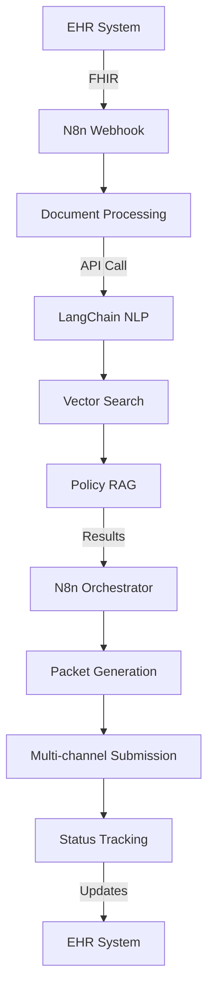

# Technology Stack Overview

## 🎯 Hybrid Architecture Philosophy

GreenLightPA employs a **hybrid architecture** that combines the visual workflow orchestration capabilities of N8n with the advanced AI processing power of LangChain. This approach provides the best of both worlds: low-code workflow management and sophisticated AI capabilities.

## 🏗️ Architecture Layers

```
┌─────────────────────────────────────────────────────────────────┐
│                     Frontend Layer                              │
│  React 18 + TypeScript + Next.js 14 + shadcn/ui              │
└─────────────────────────────────────────────────────────────────┘
                              │
┌─────────────────────────────────────────────────────────────────┐
│                    API Gateway Layer                            │
│              FastAPI + Pydantic + OAuth 2.0                   │
└─────────────────────────────────────────────────────────────────┘
                              │
┌─────────────────────────────────────────────────────────────────┐
│                Workflow Orchestration Layer                     │
│                        N8n Engine                             │
└─────────────────────────────────────────────────────────────────┘
                              │
┌─────────────────────────────────────────────────────────────────┐
│                   AI Processing Layer                           │
│              LangChain + LangGraph + OpenAI                   │
└─────────────────────────────────────────────────────────────────┘
                              │
┌─────────────────────────────────────────────────────────────────┐
│                    Data Storage Layer                           │
│         PostgreSQL + ChromaDB + Redis + S3                   │
└─────────────────────────────────────────────────────────────────┘
```

## 🛠️ Core Technologies

### **Backend Core**
| Technology | Version | Purpose | Rationale |
|------------|---------|---------|-----------|
| **Python** | 3.11+ | Primary language | Async support, type safety, AI/ML ecosystem |
| **FastAPI** | 0.104+ | Web framework | Auto-docs, async, type validation |
| **Pydantic** | 2.5+ | Data validation | Type safety, serialization |
| **Uvicorn** | 0.24+ | ASGI server | High performance, async support |

### **Workflow Orchestration**
| Technology | Purpose | Benefits |
|------------|---------|----------|
| **N8n** | Visual workflow builder | 600+ integrations, low-code, monitoring |
| **N8n Self-hosted** | Deployment strategy | Data control, custom nodes, HIPAA compliance |

### **AI/ML Framework**
| Technology | Version | Purpose | Benefits |
|------------|---------|---------|----------|
| **LangChain** | 0.1+ | LLM orchestration | Multi-LLM support, RAG, agents |
| **LangGraph** | 0.0.20+ | Advanced workflows | State machines, complex logic |
| **LangSmith** | Latest | AI observability | Tracing, debugging, evaluation |
| **OpenAI GPT-4o** | Latest | Primary LLM | Best reasoning, medical knowledge |
| **Local Llama-3 70B** | Latest | Fallback LLM | On-premise PHI processing |

### **Vector & Data Storage**
| Technology | Use Case | Environment |
|------------|----------|-------------|
| **ChromaDB** | Vector storage | Development |
| **Supabase PostgreSQL + pgvector** | Vector storage | Production |
| **PostgreSQL** | Application data | Development |
| **Supabase PostgreSQL** | Application data | Production |
| **Redis** | Caching & sessions | Development |
| **Upstash Redis** | Caching & sessions | Production |

### **Healthcare Integrations**
| Technology | Purpose | Coverage |
|------------|---------|----------|
| **FHIR R4** | EHR integration | Standard healthcare data exchange |
| **HL7 FHIR** | Clinical data | Encounter, DocumentReference |
| **X12 278** | Prior auth | Standard PA format |
| **Change Healthcare API** | Payer integration | >70% US payers |
| **SMART-on-FHIR** | EHR widgets | OAuth + FHIR context |

### **Communication & Voice**
| Technology | Purpose | Integration |
|------------|---------|-------------|
| **Twilio Voice** | IVR automation | N8n workflows |
| **OpenAI Whisper** | Speech-to-text | Voice processing |
| **Secure Fax APIs** | Legacy payer systems | N8n connectors |

## 🔧 Development & DevOps Stack

### **Development Tools**
```python
# Code Quality
black==23.11.0      # Code formatting
isort==5.12.0       # Import sorting
mypy==1.7.1         # Type checking
pytest==7.4.3      # Testing framework

# Development Environment
python-dotenv==1.0.0    # Environment management
rich==13.7.0            # CLI enhancement
typer==0.9.0            # CLI framework
```

### **Infrastructure & Deployment**
| Technology | Purpose | Environment |
|------------|---------|-------------|
| **Docker** | Containerization | All environments |
| **Docker Compose** | Local orchestration | Development |
| **Fly.io Machines** | Container orchestration | Production |
| **Fly.io CLI** | Deployment automation | Production |
| **Supabase** | Database hosting | Production |
| **Upstash** | Cache hosting | Production |

### **CI/CD Pipeline**
```yaml
# GitHub Actions → Fly.io
Stages:
  - Code Quality (Black, isort, mypy)
  - Testing (pytest, coverage)
  - Security Scanning
  - Docker Build
  - Deploy to Staging (Fly.io)
  - Integration Tests
  - Deploy to Production (Fly.io)
```

### **Monitoring & Observability**
| Technology | Purpose | Integration |
|------------|---------|-------------|
| **LangSmith** | AI tracing | LangChain workflows |
| **N8n Monitoring** | Workflow analytics | Built-in dashboards |
| **Prometheus** | Metrics collection | Custom metrics |
| **Grafana** | Visualization | Dashboards |
| **Loki** | Log aggregation | Centralized logging |

## 🔒 Security & Compliance Stack

### **Authentication & Authorization**
| Technology | Purpose | Standard |
|------------|---------|----------|
| **Auth0** | Identity provider | OAuth 2.0 / OIDC |
| **SMART-on-FHIR** | EHR context | Healthcare standard |
| **JWT Tokens** | API authentication | Stateless auth |
| **RBAC** | Permission system | Role-based access |

### **Data Protection**
| Method | Implementation | Coverage |
|--------|----------------|----------|
| **TLS 1.3** | Transport encryption | All communications |
| **AES-256** | Data at rest | Database, files |
| **Field-level encryption** | PHI protection | Sensitive columns |
| **Audit logging** | Compliance tracking | All operations |

### **HIPAA Compliance**
- **BAAs Signed**: OpenAI, Supabase, Upstash, Fly.io
- **PHI Handling**: Secure processing workflows with RLS
- **Access Controls**: RBAC + audit trails + Supabase RLS
- **Data Retention**: Compliant policies with automated backups

## 🌐 External Integration Stack

### **Payer APIs**
```bash
# Primary Integration
Change Healthcare API    # X12 278, eligibility
Direct FHIR-PA endpoints # Modern payer APIs

# Fallback Methods
Selenium automation      # Portal scraping
Secure fax APIs         # Legacy systems
```

### **EHR Integration Patterns**
```javascript
// SMART-on-FHIR Widget
const smartLaunch = {
  clientId: "greenlightpa-client",
  scope: "patient/*.read encounter/*.read",
  redirectUri: "https://app.greenlightpa.com/launch"
}
```

## 📊 Performance & Scalability

### **Target Metrics**
| Metric | Target | Technology Enabler |
|--------|--------|-------------------|
| System Latency | <5s | FastAPI async, Upstash Redis caching |
| Throughput | 10k requests/day | Fly.io auto-scaling, LangChain optimization |
| Availability | 99.9% | Fly.io multi-region, Supabase HA |
| AI Accuracy | ≥92% | LangChain evaluation, prompt engineering |

### **Scaling Strategy**
```yaml
# Horizontal Scaling
N8n: Multiple Fly.io machines with auto-scaling
LangChain: Containerized microservices on Fly.io
Database: Supabase with connection pooling
Cache: Upstash Redis with global edge network

# Vertical Scaling
AI Models: GPU instances via Fly.io machines
Database: Supabase auto-scaling storage
Storage: Fly.io volumes with snapshots
```

## 🔄 Development Workflow

### **Local Development Stack**
```bash
# Required Services
docker-compose up -d postgres redis

# N8n Development
docker run -p 5678:5678 n8nio/n8n

# LangChain Services
uvicorn app.main:app --reload

# Frontend (when available)
npm run dev
```

### **Data Flow Architecture**


## 🚀 Technology Roadmap

### **Short Term (Q1 2024)**
- [ ] N8n workflow development
- [ ] LangChain RAG optimization
- [ ] ChromaDB → PostgreSQL migration
- [ ] Basic monitoring setup

### **Medium Term (Q2-Q3 2024)**
- [ ] Advanced AI agents (LangGraph)
- [ ] Multi-tenant workflows
- [ ] Enhanced security features
- [ ] Performance optimization

### **Long Term (Q4 2024+)**
- [ ] Edge deployment options
- [ ] Advanced analytics
- [ ] Workflow marketplace
- [ ] Mobile applications

---

*This tech stack is designed for scalability, maintainability, and HIPAA compliance while providing the flexibility needed for healthcare integration workflows.* 